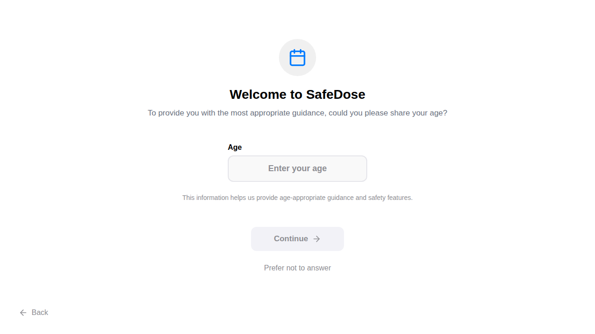
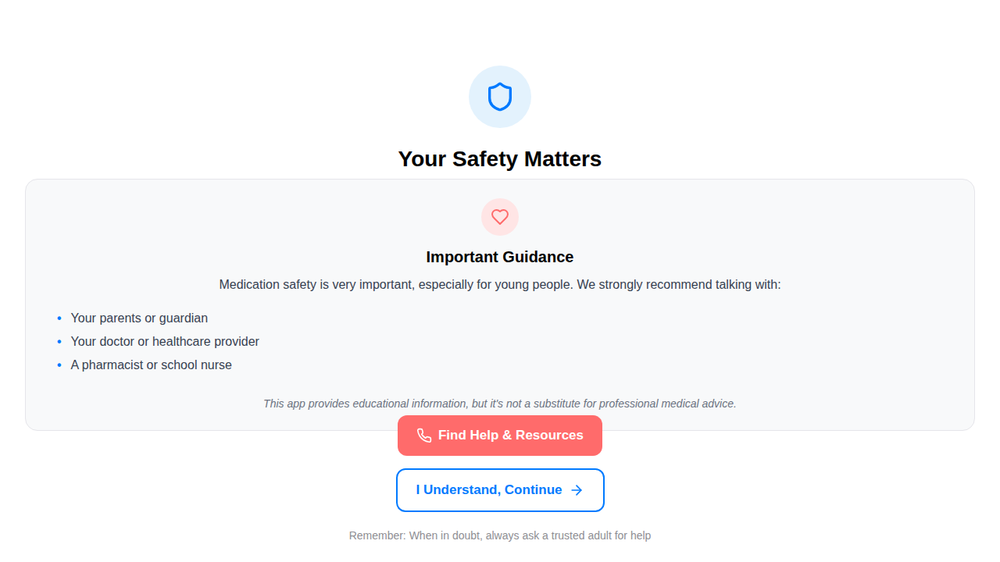

# Child Safety Features Implementation

This document describes the implementation of child safety features in SafeDose to provide appropriate guidance and warnings for underage users.

## Overview

The child safety features enhance the onboarding flow by:
1. **Collecting user age early** in the onboarding process
2. **Providing specialized safety guidance** for users under 18
3. **Maintaining professional appearance** while being gentle and supportive

## New Onboarding Flow

### Previous Flow
```
Welcome → Demo → User Type → Main App
```

### New Flow
```
Welcome → Age Collection → [Child Safety (if <18)] → Demo → User Type → Main App
```

## New Screens

### 1. Age Collection Screen (`/onboarding/age`)
- **Purpose**: Collect user age for safety and personalization
- **Features**:
  - Professional, clean interface with Calendar icon
  - Numeric input validation (13-120 age range)
  - Skip option ("Prefer not to answer")
  - Privacy notice explaining why age is collected
  - Mobile-responsive design

### 2. Child Safety Screen (`/onboarding/child-safety`)
- **Purpose**: Provide gentle safety guidance for users under 18
- **Features**:
  - Supportive messaging with Shield icon
  - Clear recommendations to consult trusted adults
  - "Find Help & Resources" button with comprehensive guidance
  - Professional medical advice disclaimer
  - Encourages consultation with parents, healthcare providers, pharmacists

## Routing Logic

```typescript
// Age collection routing
if (age < 18) {
  // Route to child safety screen
  router.push('/onboarding/child-safety');
} else {
  // Route directly to demo
  router.push('/onboarding/demo');
}

// Skip age collection
router.push('/onboarding/demo'); // No age restrictions
```

## Analytics Integration

### New Events
- `age_collection_shown` - When age collection screen is displayed
- `age_collection_completed` - When user provides age (includes age and age_range)
- `age_collection_skipped` - When user skips age entry
- `child_safety_screen_shown` - When child safety screen is displayed
- `child_safety_continue` - When user continues from safety screen
- `child_safety_seek_help` - When user clicks help resources

### Enhanced Existing Events
- `onboarding_complete` - Now includes age and age_range fields

## Technical Implementation

### Type Updates
```typescript
interface UserProfile {
  // ... existing fields
  age?: number; // New optional age field
}

type UserProfileAnswers = {
  // ... existing fields
  age: number | null; // New age field in answers
}
```

### Age Range Classification
- `minor`: Under 18 years
- `adult`: 18-64 years  
- `senior`: 65+ years
- `unknown`: Age not provided

## Child Safety Guidance

The child safety screen provides gentle, supportive guidance including:

### Recommended Contacts
- Parents or guardians
- Healthcare providers (doctors, nurses)
- Pharmacists or school nurses

### Resources Provided
- Guidance on talking to trusted adults
- Poison control center information
- Emergency contact information (911)
- Emphasis on adult supervision for medication safety

### Professional Disclaimer
Clear messaging that the app provides educational information only and is not a substitute for professional medical advice.

## Mobile Responsiveness

Both new screens include comprehensive mobile optimizations:
- Smaller fonts and padding for mobile devices
- Touch-friendly button sizes
- Responsive layouts that work across screen sizes
- Optimized spacing and margins

## Screenshots

### Age Collection Screen


### Child Safety Screen  


## Impact on User Experience

### For Minors (Under 18)
1. Professional age collection creates serious, medical app impression
2. Gentle safety guidance without being condescending
3. Clear pathways to seek appropriate help
4. Continued access to educational content with proper warnings

### For Adults (18+)
1. Quick age collection enhances personalization
2. Direct routing to demo maintains smooth onboarding
3. Age data enables future age-appropriate features

### For All Users
1. Optional age collection respects privacy
2. Professional appearance enhanced by thoughtful age verification
3. Responsible approach to medication safety education

## Compliance and Safety

- **Privacy**: Age is optional and can be skipped
- **Safety**: Clear warnings and guidance for appropriate age groups
- **Professional**: Medical disclaimers and referrals to healthcare professionals
- **Supportive**: Gentle language that doesn't restrict access but encourages safety